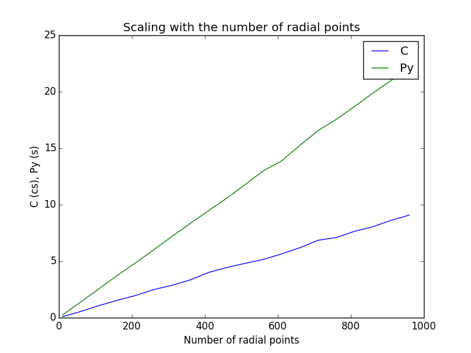

**Numerical Any particle Molecular Orbital (nAPMO) package.**

:Author: Fernando Posada Correa, MHPC, 2015

1. the ipython notebook.

This folder contains some examples using the code. The first one is a ipython notebook called ``nAPMO.ipynb`` which contains information step by step on how the code works.

Link:  :download:`nAPMO notebook example <../examples/nAPMO.ipynb>`

nbviewer: http://nbviewer.ipython.org/url/efposadac.github.io/nAPMO/_downloads/nAPMO.ipynb

2. Integration on diatomic Molecules

The second example can be found in the folder ``Density``. This contains examples for the calculation of :math:`\int \rho({\bf r})` for diatomic molecules for elements from Z = 1, up to Z = 8, with exception of Helium. The outcome of this test must be:

::

	Grid Information:
	-----------------
	Radial Points:  100
	Angular Points:  194
	System Int C         Int Py        Error          Time Py       Time C
	H2   2.00010688    2.00010688    0.00010688     4.3246562     0.0331886
	Li2  6.00025286    6.00025286    0.00025286    10.3566766     0.1109531
	Be2  8.00023682    8.00023682    0.00023682    10.2098806     0.1123509
	B2  10.00049433   10.00049433    0.00049433    10.1175656     0.1098449
	C2  12.00127662   12.00127662    0.00127662    10.2129803     0.1131680
	N2  14.00085234   14.00085234    0.00085234    10.4540348     0.1119723
	O2  16.00068683   16.00068683    0.00068683    10.2155397     0.1107540

The grid used for this calculation was 110-194 (rad.-ang.). It can be seen that the performance of Python code is really slow, taking in to account that for each molecule the code is calculating only one integral. On the other hand, the C code is two orders of magnitude faster.

3. Performance

An script to plot the comparison of the performance (scaling with respect to the grid points) and comparison between timings of C and Python codes is provided in the ``Performance`` folder.

This script produces the following graphs to show the scaling with respect to the number of grid points (radial and angular):

|radial_perf|

|angular_perf|

Timing for Python code ``Py`` is in centiseconds (cs). As shown in the plots, the algorithm is linear with respect with the number of angular or radial points, the important thing here is the prefactor in booth cases, in the case of C code, the prefactor is two orders of magnitude smaller than the Python's code prefactor. For the integral of this test case :math:`\int \rho({\bf r})` for a  H2 molecule, a grid of 110-194 is enough to reach the exact value, this integral takes 2.6 s in the Python code and 0.01 s in the C one.

As conclusion it can be said that the use of C code has improve the calculation time.

Note:

All ``*.dens`` files are density matrices to perform the integration.

