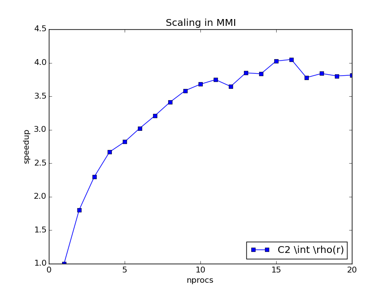
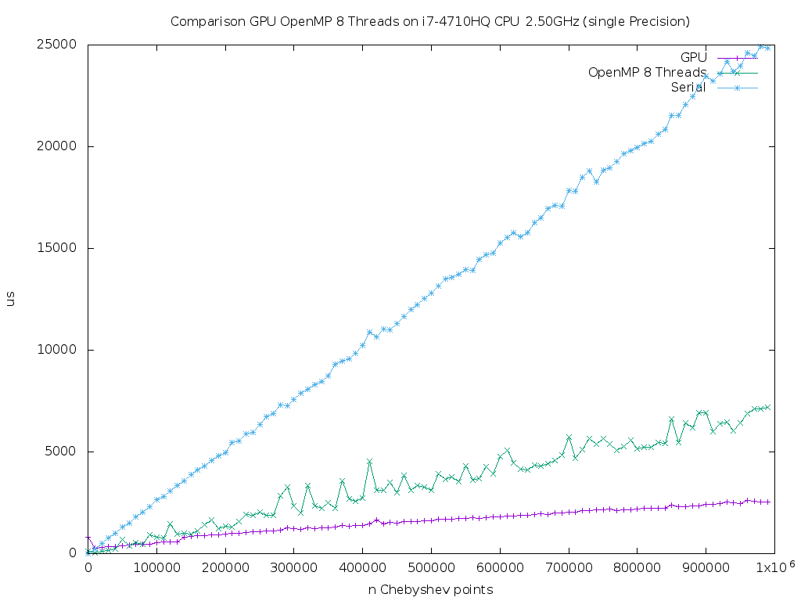
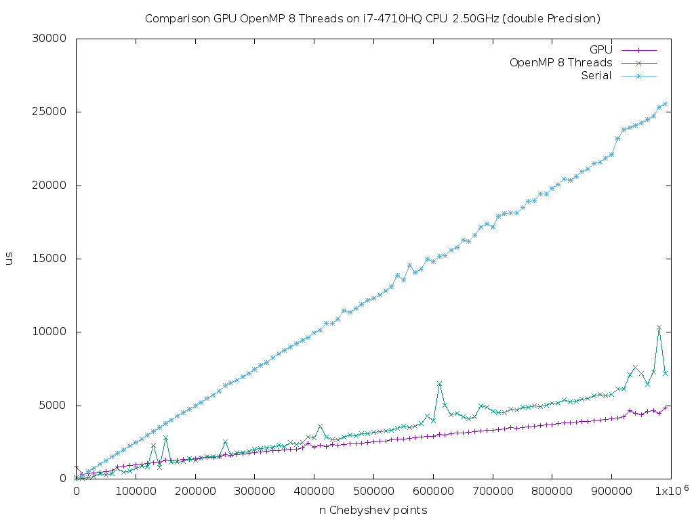

**Numerical Any particle Molecular Orbital (nAPMO) package.**

:Author: Fernando Posada Correa, MHPC, 2015

1. **the ipython notebook.**

This folder contains some experiments/results using the code. The first one is a ipython notebook called ``nAPMO.ipynb`` which contains information step by step on how the code works.

Link:  :download:`nAPMO notebook example <../results/nAPMO.ipynb>`

nbviewer: http://nbviewer.ipython.org/url/efposadac.github.io/nAPMO/_downloads/nAPMO.ipynb

2. **Integration on diatomic Molecules**


The second example can be found in the folder ``Density``. This contains results for the calculation of :math:`\int \rho({\bf r})` for diatomic molecules for elements from Z = 1, up to Z = 8, with exception of Helium. The outcome of this test must be:

::

	Grid Information:
	-----------------
	Radial Points:  100
	Angular Points:  194
	System Int C         Int Py        Error          Time Py       Time C
	H2   2.00010688    2.00010688    0.00010688     4.3246562     0.0331886
	Li2  6.00025286    6.00025286    0.00025286    10.3566766     0.1109531
	Be2  8.00023682    8.00023682    0.00023682    10.2098806     0.1123509
	B2  10.00049433   10.00049433    0.00049433    10.1175656     0.1098449
	C2  12.00127662   12.00127662    0.00127662    10.2129803     0.1131680
	N2  14.00085234   14.00085234    0.00085234    10.4540348     0.1119723
	O2  16.00068683   16.00068683    0.00068683    10.2155397     0.1107540


The grid used for this calculation was 110-194 (rad.-ang.). It can be seen that the performance of Python code is really slow, taking in to account that for each molecule the code is calculating only one integral. On the other hand, the C code is two orders of magnitude faster.

3. **Performance (Serial)**

An script to plot the comparison of the performance (scaling with respect to the grid points) and comparison between timings of C and Python codes is provided in the ``Performance`` folder.

This script produces the following graphs to show the scaling with respect to the number of grid points (radial and angular):

|radial_perf|

|angular_perf|

Timing for Python code ``Py`` is in centiseconds (cs). As shown in the plots, the algorithm is linear with respect with the number of angular or radial points, the important thing here is the prefactor in booth cases, in the case of C code, the prefactor is two orders of magnitude smaller than the Python's code prefactor. For the integral of this test case :math:`\int \rho({\bf r})` for a  H2 molecule, a grid of 110-194 is enough to reach the exact value, this integral takes 2.6 s in the Python code and 0.01 s in the C one.

As conclusion it can be said that the use of C code has improve the calculation time.

4. **OpenMP Implementation**

The following graphs show the scaling of OpenMP implementation on the generation of the Gauss-Chebishev quadrature and in the overall Molecular Multicenter integrator (MMI) up to 20 threads in a Intel Xeon E5-2680V2 Ivy Bridge 10 cores 20 Threads.

|gauss_omp|

|mmi_omp|

The Scaling seems to be linear up to 18 threads for a 5810-1000 grid, which is the biggest grid used so far (in a real case scenario unnecessary). The time for one thread was  42.38 s and for 20, 3.30 s, supposing a speedup of approx. 12x.

For a real case scenario, i.e. a 1202-100 grid (next plot), the speed up goes up to 4x because for such grid the serial part of the code becomes to be more relevant than the  parallel part. Times: one thread: 1.11 s and for 20 threads 0.28 s

|mmi_omp_small|


5. **CUDA Implementation**

|gauss_cuda_single|

|gauss_cuda_double|

Notes on CUDA implementation.

The proposed parallelization strategy consists on copy all structures to the device (``System`` and ```Grid`), calculate Gauss-Cheb points on device, copy Lebedev pointer from host to device, run in two dimensional grids of threads and maintaining the same structure of calculation by calling ``__device__`` kernels for tasks such as the calculation of Becke weights, and the calculation of the Functional. I

We found that to optimize the occupancy of the device the optimum number of ``THREADS_PER_BLOCK`` is 8. it gives around 85% of occupancy (for a optimal number of registers), however the code is 2 times slower than the serial one. The reason? The number of registers used for the kernel.

With this scheme the kernel needs 72 registers against an optimal of 36. The use of such amount of registers generates many threads to be in idle state, because the amount of registers in the SMD is limited, if there is not enough registers to calculate all wraps the total execution time for a given block will increase.

The next section contains notes on the solution a this problem in order to get the maximum possible performance.

0. Test context:

As reference we calculate molecular integration over a 1202 x 1000 grid points. The time for the serial executable was 1.8 s. For OMP 4 cores 0.5 s. The time for the proposed strategy over CUDA, 72 registers 8 x 8 ``THREADS_PER_BLOCK``, is 4.3 s.

1. Force the use of less registers via compiler switch  ``--maxrregcount 36`` in compilation time. Result: 5.1 s.

Forcing the use of less registers than the required generates a excessive use of local memory (aka global device memory). The latency of this memory is orders of magnitude greater that the cache/register bandwidth. As a consequence the time increases.

2. Analise the amount of registers needed in each step of the kernel, Analysis done by compiling the code with ``-O2`` optimization flag.

- Function ``sincos`` 16 registers + 6 register for call, total times called, 2 total of registers 38 registers
- Function ``atomicAdd`` 26 registers.
- Function ``grid_density_cuda`` 6 registers.
- Function ``grid_weights_cuda`` 2 registers.
- Remaining operations 10 registers

2.1 ``sincos`` Function is used to convert from spherical to cartesian coordinates. Proposed optimization split the kernel in two and pass the grid to the integrator in cartesian coordinates. Result: 

Note:

All ``*.dens`` files are density matrices to perform the integration.

.. |radial_perf| image:: ../results/Perf_Serial/images/radial_points_scaling.png
.. |angular_perf| image:: ../results/Perf_Serial/images/angular_points_scaling.png
.. |gauss_omp| image:: ../results/Perf_OMP/images/gauss_chebishev.png
.. |mmi_omp| image:: ../results/Perf_OMP/images/mmi.png


